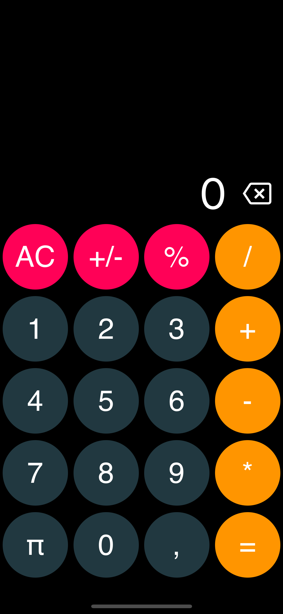

# calculator

## Description
This is a simple calculator app that can perform basic arithmetic operations. It is built using react-native and expo.

## Installation
1. Clone the repo
2. Run `npm install` to install the dependencies
3. Run `npm start` to start the app

## Usage
1. Enter the first number
2. Select the operation
3. Enter the second number
4. Click the `=` button to get the result
5. Enjoy your result

## License
This project is licensed under the MIT License - see the [LICENSE](./LICENSE) file for details

## Author
Hi! I am [kijmoshi](https://kijmoshi.xyz) young developer from Poland. I love to code and learn new things. I am currently learning react-native and this project is one of my first projects in this technology. I hope you will like it. If you have any questions or suggestions feel free to contact me.

## Contact
- [kijmoshi.xyz](https://kijmoshi.xyz)

## Buy me a coffee
If you like my work and want to support me you can buy me a coffee. Thank you!

### made with ❤️ by kijmoshi